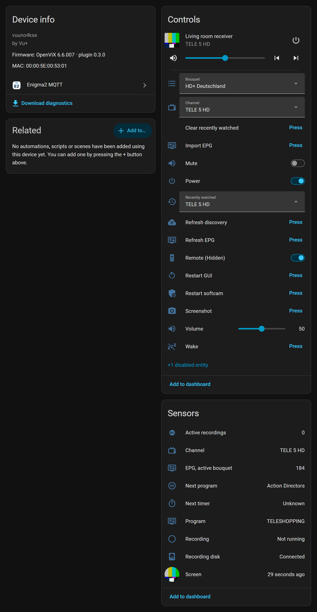
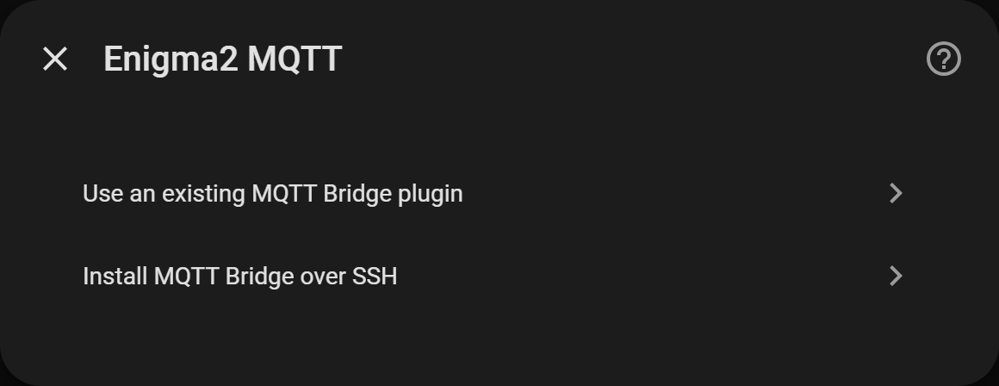
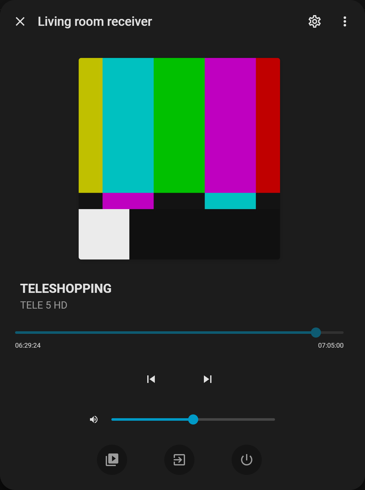
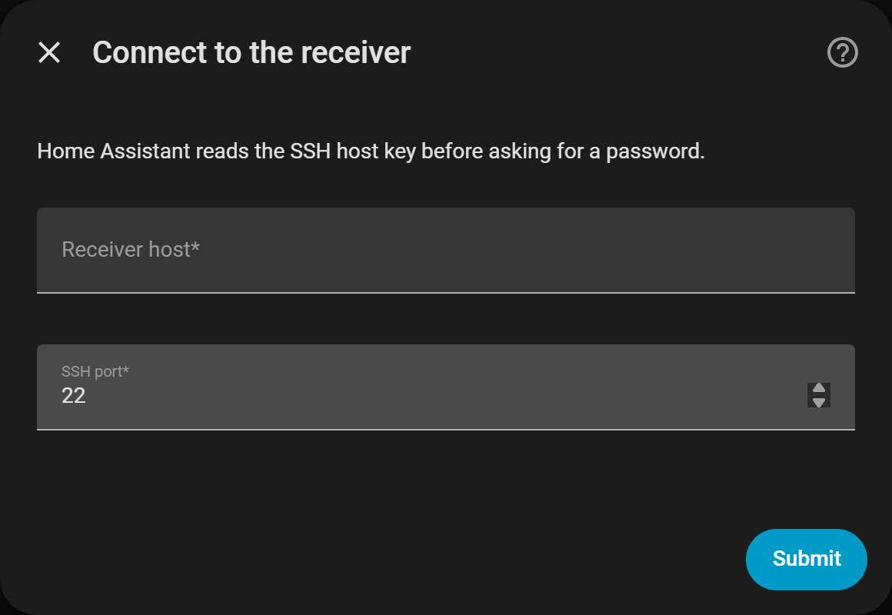
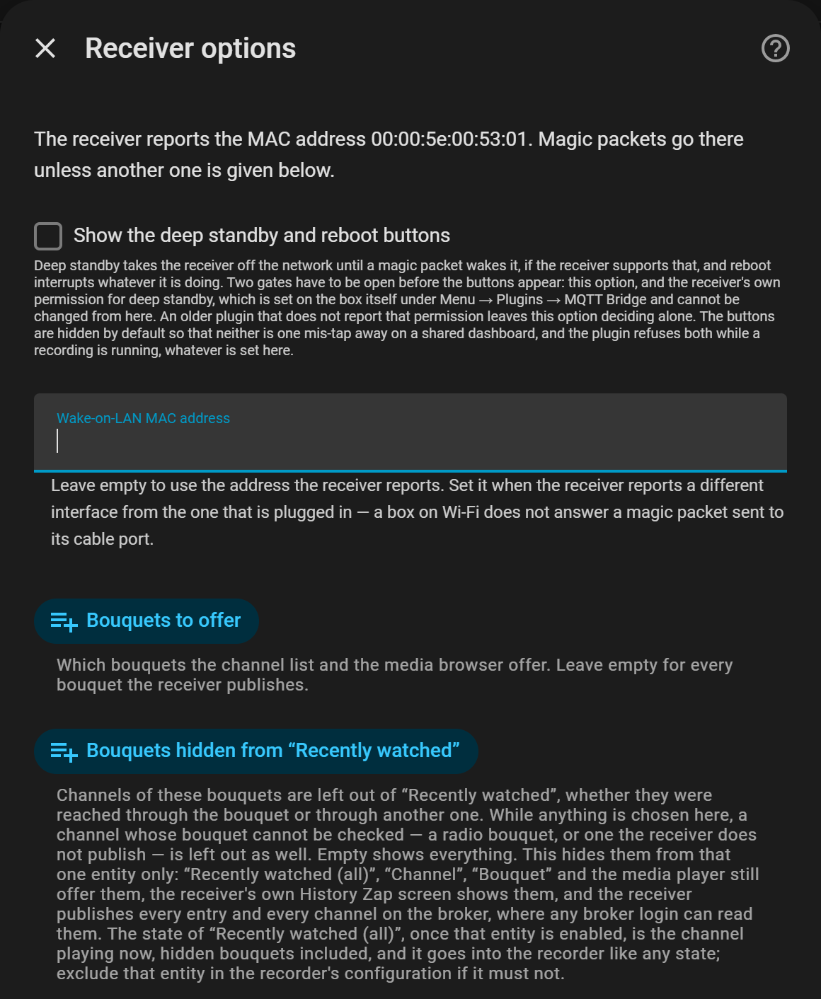

# Enigma2 MQTT for Home Assistant

Brings an Enigma2 satellite receiver (Vu+, Dreambox, Zgemma, Octagon and others on OpenViX or
OpenATV) into Home Assistant over your own MQTT broker. Changes show up as they happen, with no
polling.

The receiver side is the [enigma2-mqtt-bridge](https://github.com/deltasystems-pl/enigma2-mqtt-bridge)
plugin. You do not have to install it by hand: this integration can put it on the receiver over SSH.

## What you get

- One device per receiver, with a media player: power, volume, channel up and down, choosing a
  channel or bouquet, browsing bouquets, and the TV picture as artwork.
- Sensors for the channel, the programme now and next, running recordings, the next timer and the
  receiver's last error.
- Remote keys you can send from automations, and every key press on the real remote as an event.
  The four colour keys are device triggers, short or long press.
- Messages on the TV: a popup, or a small toast in the corner on receivers that support it.
- The receiver's own zap history as a dropdown, so you can jump back to a recent channel.
- Buttons for a screenshot, Wake-on-LAN and a GUI restart, and an EPG refresh where the receiver
  publishes EPG grids. Softcam restart and EPG import show up only after you allow them on the
  receiver. Deep standby and reboot need two things: permission on the receiver and the
  integration's "Show the deep standby and reboot buttons" option. Waking a
  receiver from deep standby over the network has not been tested on hardware yet, so treat deep
  standby as possibly one-way.
- A guided installer, and an update entity that updates the receiver plugin from a copy shipped
  with the integration.
- A receiver that loses power shows as unavailable within about 45 seconds. Nothing goes to a cloud.

## Install

1. Open this repository in HACS and download **Enigma2 MQTT**:

   

   Without the button: in HACS, add `deltasystems-pl/hass-enigma2-mqtt` as a custom repository of
   type *Integration*.
2. Restart Home Assistant.
3. Add the integration:

   

4. No plugin on the receiver yet? Pick **Install MQTT Bridge over SSH**, check the receiver's SSH
   key fingerprint, and enter the SSH password and your broker details. The installer sets up the
   plugin and adds the device. A receiver that already runs the plugin usually shows up by itself
   under *Settings -> Devices & services*.

   

Manual install: download `enigma2_mqtt.zip` from the
[latest release](https://github.com/deltasystems-pl/hass-enigma2-mqtt/releases/latest), extract it
into `config/custom_components/enigma2_mqtt/` and restart. Do not keep a backup copy inside
`custom_components/` ([why](DOCUMENTATION.md#2-installation)).

## Requirements

- Home Assistant 2026.3 or newer, with the MQTT integration set up (the Mosquitto broker add-on is
  fine).
- A receiver on a Python 3 Enigma2 image. OpenViX 6.x and OpenATV 7.x are supported, OpenPLi 9
  and OpenBH 6 are best effort. So far it has been run on one box, a Vu+ Uno 4K SE on OpenViX 6.6.
- Plugin 0.3.0 to go with integration 0.3.1; the installer brings that version.
- SSH access to the receiver, if the integration should install or update the plugin.

## Screenshots

<table>
  <tr>
    <td></td>
    <td></td>
  </tr>
  <tr>
    <td>Media player</td>
    <td>Zap history</td>
  </tr>
  <tr>
    <td></td>
    <td></td>
  </tr>
  <tr>
    <td>Installer</td>
    <td>Options</td>
  </tr>
</table>

## Documentation

- [DOCUMENTATION.md](DOCUMENTATION.md): setup, options, every entity and action, troubleshooting
  and FAQ.
- The receiver plugin:
  [installation](https://github.com/deltasystems-pl/enigma2-mqtt-bridge/blob/main/docs/INSTALL.md),
  [setup](https://github.com/deltasystems-pl/enigma2-mqtt-bridge/blob/main/docs/SETUP.md),
  [troubleshooting](https://github.com/deltasystems-pl/enigma2-mqtt-bridge/blob/main/docs/TROUBLESHOOTING.md)
  and the [MQTT topics](https://github.com/deltasystems-pl/enigma2-mqtt-bridge/blob/main/docs/TOPICS.md).
- [ROADMAP.md](ROADMAP.md), [CHANGELOG.md](CHANGELOG.md), the design decisions in
  [docs/adr](docs/adr/) and the quality bar the project holds itself to in [docs/QUALITY.md](docs/QUALITY.md).
- [CONTRIBUTING.md](CONTRIBUTING.md). Testers on OpenATV, OpenPLi or OpenBH and translators are
  especially welcome.

**Security.** Give the receiver its own broker login and change the image's default root
password, because the broker password is stored on the receiver. If you let the installer keep
the SSH password for updates, it is stored unencrypted in Home Assistant's configuration. See
[SECURITY.md](SECURITY.md) and [the setup notes](DOCUMENTATION.md#3-configuration).

**Privacy.** The receiver reports what is being watched and which keys are pressed, and the screen
entity is a picture of the TV. None of it leaves your network, but Home Assistant's recorder keeps
a history. [How to exclude it](DOCUMENTATION.md#10-privacy).

## License

[MIT](LICENSE). The receiver plugin is a separate program under GPL-2.0-or-later and ships
here together with its source; see [NOTICE](NOTICE).
